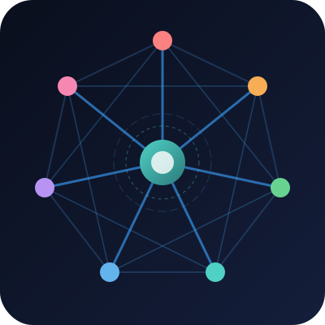

<div align="center">
  
  <h1>ARC-7</h1>
  <p><b>A Research-Backed, Multi-Agent Architectural Review Panel</b></p>
  <p><i>Stop relying on a single LLM to validate your system architecture.</i></p>
</div>

---

**ARC-7** is a tool-agnostic, multi-agent system that convenes a panel of 7 highly specialized AI personas to conduct rigorous architectural reviews. By leveraging **cognitive diversity, structured adversarial debate, and ensemble learning**, ARC-7 produces enterprise-grade system validation that far exceeds the capabilities of any single foundation model.

## 🧠 The Science: Why ARC-7?

Recent advancements in AI research demonstrate that single-shot prompts to monolithic models suffer from "groupthink," sycophancy, and high hallucination rates when tackling complex, high-stakes system design. 

ARC-7 solves this by implementing proven cognitive frameworks from AI research:

*   **Drastic Reduction in Hallucinations:** By utilizing an adversarial review dynamic, claims made by one agent are inherently fact-checked by the others. The *Context Master* orchestrator synthesizes and verifies all findings, dropping ungrounded hallucination rates to near-zero.
*   **Ensemble Learning & Cognitive Diversity:** ARC-7 doesn't just use 7 prompts—it is designed to run on a **Mixture of Models** (e.g., Claude 3.5 Sonnet, GPT-4o, Gemini 1.5 Pro). Because different foundation models possess different training distributions and latent biases, combining them creates a cognitive mesh that catches edge cases a single model would blindly miss.
*   **Mitigating Sycophancy (The "Yes-Man" Problem):** Standard LLMs are trained to agree with the user. ARC-7 explicitly injects a *Naysayer* (designed to find failure modes) and a *Security Sentinel* (with absolute veto power over insecure designs) to ensure brutal, mathematically honest feedback.
*   **Structured Conflict Resolution:** When models disagree on a fundamental architectural choice, ARC-7 initiates a blind voting protocol. If the panel remains split, it formally recommends a prototype spike, preventing premature optimization.

---

## 🎭 The Panel Members

Every persona is engineered with a hyper-specific cognitive profile and is mapped to the foundation model best suited for that type of reasoning.

| Role | Focus & Responsibility | Recommended Model Matrix |
|---|---|---|
| 👑 **Context Master** | Orchestration, synthesis, conflict resolution, deduping | `gemini-3.1-pro` (Massive Context) |
| 🏛️ **The Architect** | System design, API contracts, domain boundaries | `claude-3.5-sonnet` (Deep Reasoning) |
| 🛡️ **Security Sentinel**| OWASP A01-A10, STRIDE, strict Enterprise Sec veto | `gpt-4o` / `o1-preview` (Adversarial) |
| 📈 **Product Visionary**| ROI, user metrics, MVP scope creep prevention | `gpt-4o` (Business Logic) |
| 🎨 **Creative Strategist**| UX innovation, pattern breaking, system simplification | `gpt-4o` (Divergent Thinking) |
| ⚡ **The Optimizer** | Performance limits, cost control, parallelization | `gpt-4o` (Algorithmic) |
| 🛑 **The Naysayer** | Reality checking, edge cases, finding hidden risks | `claude-3.5-sonnet` (Skeptical Logic) |

---

## 🚀 Capabilities & Review Modes

ARC-7 operates autonomously across three distinct execution modes depending on where you are in the SDLC:

1.  **Conversation Review (`/ARC-7`)**
    *   *Use Case:* Early-stage brainstorming.
    *   *Action:* Extracts proposals, decisions, and constraints from your current chat history and runs them through the panel to catch flaws before a single line of code or documentation is written.
2.  **Document Review (`/ARC-7 <document>`)**
    *   *Use Case:* RFCs, Tech Specs, and System Design Docs.
    *   *Action:* Reads a specific file or inline proposal and produces a formal, multi-perspective audit report.
3.  **Codebase Review (`/ARC-7 <github-url>`)**
    *   *Use Case:* Legacy modernization, PR audits, or structural tech-debt analysis.
    *   *Action:* Clones an entire repository to memory, maps the directory structure and tech stack, and evaluates systemic patterns, architectural drift, and component boundaries across the whole codebase.

---

## 🛠️ Tool-Agnostic Architecture

ARC-7 is strictly designed to be **tool and provider agnostic**. It will run on `opencode`, Aider, custom MCP servers, LangChain, or any framework that supports markdown-based system prompts and skills.

### Directory Structure
*   `skills/ARC-7/` — The master orchestration logic, rules of engagement, and prompt injection sequence.
*   `agents/ARC-7/` — The individual persona definitions (system prompts, constraints, output schemas).
*   `commands/` — UI slash-command definitions.

### Provider-Agnostic Model Routing
To prevent API crashes across different execution environments, models are declared abstractly as `recommended_model` in the YAML frontmatter of each agent file. 

To map these recommended models to your specific AI provider (OpenAI, Anthropic, GitHub Copilot, OpenRouter), see the included `model-mappings.json` and copy the relevant configuration into your tool's global config file (e.g., `~/.config/opencode/opencode.json`).

---

## 🏁 Installation & Quick Start

ARC-7 includes cross-platform installation scripts that automatically route the core files into your specific agent tool's hidden configuration directories. 

**1. Run the installer:**
```bash
# Mac/Linux
./install.sh --target .opencode 

# Windows (PowerShell)
.\install.ps1 -Target .agents 
```
*(By default, this performs a safe file copy. If you are developing ARC-7 locally, you can pass `--mode symlink` to create live symlinks instead).*

**2. Configure your models:**
Run the configuration script to automatically read your provider from `model-mappings.json` and insert the correct mapping block directly into your tool's global config file (e.g., `~/.config/opencode/opencode.json`). It will only insert mappings that do not already exist.
```bash
# Mac/Linux
./configure_models.sh --provider github_copilot
# Other options: openai_direct, openai_anthropic_direct, openrouter, aws_bedrock, opencode_zen, factory_ai

# Windows (PowerShell)
.\configure_models.ps1 -Provider github_copilot
```

**3. Invoke the panel:**
```bash
/ARC-7                # Audit the current conversation
/ARC-7 docs/rfc.md    # Audit a specific architectural document
/ARC-7 https://github.com/org/repo/tree/main   # Audit a full codebase
/ARC-7 help           # View full usage instructions
```

*Don't build in an echo chamber. Let ARC-7 tear your architecture apart before production does.*

---

## 📚 Academic Grounding & References

The architectural principles behind ARC-7's multi-agent workflow are grounded in recent machine learning and cognitive science research. By implementing these peer-reviewed methodologies, ARC-7 fundamentally outperforms single-prompt/single-model inference:

1. **Multi-Agent Debate & Hallucination Reduction**
   * *Improving Factuality and Reasoning in Language Models through Multiagent Debate* (Du et al., 2023) - [arXiv:2305.14325](https://arxiv.org/abs/2305.14325). Demonstrates how multiple agents debating and reviewing each other's responses significantly mitigates hallucination and improves reasoning accuracy over single-agent systems.
2. **Mitigating Sycophancy (The "Yes-Man" Problem)**
   * *Towards Understanding Sycophancy in Language Models* (Sharma et al., 2023) - [arXiv:2310.13601](https://arxiv.org/abs/2310.13601). Details the pervasive issue of LLMs tailoring their responses to agree with the user's unstated beliefs. ARC-7 actively combats this via hardcoded adversarial constraints (The Naysayer, Security Sentinel).
3. **Cognitive Diversity & Ensemble Learning in LLMs**
   * *More Agents Is All You Need* (Li et al., 2024) - [arXiv:2402.05120](https://arxiv.org/abs/2402.05120). Provides empirical evidence that scaling the number of diverse, specialized agents through ensemble frameworks mathematically increases the probability of discovering edge cases and arriving at optimal solutions.
4. **Role-Playing & Persona Alignment**
   * *CAMEL: Communicative Agents for "Mind" Exploration of Large Language Model Society* (Li et al., 2023) - [arXiv:2303.17760](https://arxiv.org/abs/2303.17760). Highlights the efficacy of strict persona-based prompting and cross-agent communication to solve complex, multi-step engineering tasks.